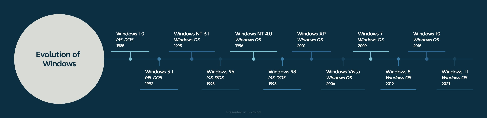

# Evolution of Windows

Windows started out in 1985 as frontend for *MS-DOS*. Several versions of Windows followed and in 1993, a new version operating system for Windows was introduced based on a *NT-Kernel*, completely independent from MS-DOS.

> [!NOTE]
>
> MS-DOS = Microsoft Disk Operating System

Since 2001, Windows has been based solely on *Windows OS*, starting with *Windows XP*, which was a huge success. Next came *Windows Vista*, which was unpopular and had performance issues. Similarly, *Windows 7* and *Windows* 8 were quickly discontinued until *Windows 10* and *Windows 11*, which are available as **Home** and **Pro** versions.

 

 

 

 

 

---

> [!NOTE]
>
> 1. The Windows Club: [History of Windows](https://www.thewindowsclub.com/history-of-windows)  
> 2. NextTechWorld: [Windows Evolution 1985–2025](https://nexttechworld.com/os/windows-evolution-1985-2025/)
> 3. TryHackMe: [Windows Fundamentals 1](https://tryhackme.com/room/windowsfundamentals1xbx)
>
