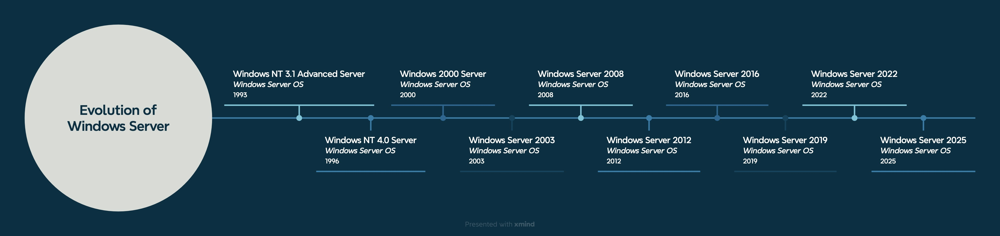

# Evolution of Windows Server

The first Windows Server was released in 1993, already based on a *NT-Kernel*. With *Windows 2000 Server*, **Active Directory** was introduced and *Windows Server 2008* introduced **virtualisation** and **cloud computing**. 

All modern Windows Servers come with a **modern Windows UI** based on Windows 10 or 11. Currently, Windows Server 2012 and 2016 are the most popular versions.

 

 

 

 

 

---

> **References**
>
> 1. Medium (Kevin Finnerty): [History of Windows Server Operating Systems](https://medium.com/@Kevin_Finnerty_Gabagool/navigating-through-time-the-history-of-windows-server-operating-systems-a4b3cab42b5e)  
> 2. Microsoft: [Windows Server release information](https://learn.microsoft.com/en-gb/windows/release-health/windows-server-release-info)
> 3. Microsoft: [Comparison of Windows Server editions](https://learn.microsoft.com/en-us/windows-server/get-started/editions-comparison?pivots=windows-server-2025)
> 4. TheTechyLife (John Elmore): [Unveiling The Most Widely Used Windows Server](https://thetechylife.com/which-windows-server-is-most-used/?utm_source=chatgpt.com)
>
> ---
